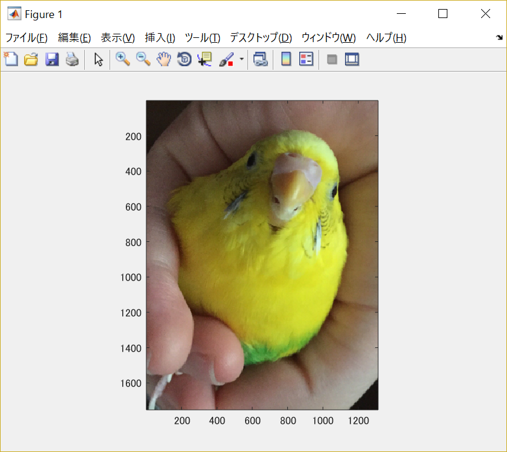
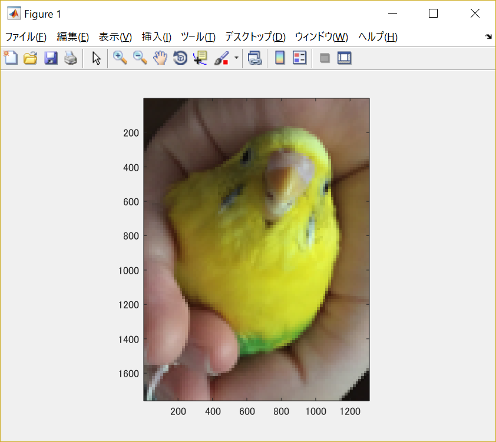

#課題1

画像「Shell.png」を原画像とし、読み込む。

原画像を読み込み、表示した結果が図1の様になる。

図1　原画像

原画像の標本化間隔を大きくしていく。

原画像を1/2サンプリングするためには、画像を1/2倍に縮小した後、2倍に拡大すればよい。

	IMG = imresize(ORG,0.5); % 画像の縮小
	IMG2 = imresize(IMG,2,'box'); % 画像の拡大
	imagesc(IMG2); axis image; % 画像の表示

この結果を図2に示す。

図2　1/2サンプリング後の原画像

同様に、原画像を1/4サンプリングするには、画像を1/2倍に縮小した後、2倍に拡大すればよい。

	IMG = imresize(IMG,0.5); % 画像の縮小
	IMG2 = imresize(IMG,4,'box'); % 画像の拡大
	imagesc(IMG2); axis image; % 画像の表示

この結果を図3に示す。

図3　1/4サンプリング後の原画像

これを繰り返し、1/8サンプリング、1/16サンプリング、1/32サンプリングも同様に行う。
1/8サンプリングのソースコードは以下の通りである。

	IMG = imresize(IMG,0.5); % 画像の縮小
	IMG2 = imresize(IMG,8,'box'); % 画像の拡大
	imagesc(IMG2); axis image; % 画像の表示

その結果が図4となる。

図4　1/8サンプリング後の原画像

1/16サンプリングのソースコードは以下の通りである。

	IMG = imresize(IMG,0.5); % 画像の縮小
	IMG2 = imresize(IMG,16,'box'); % 画像の拡大
	imagesc(IMG2); axis image; % 画像の表示

その結果が図5となる。

図5　1/16サンプリング後の原画像

1/32サンプリングのソースコードは以下の通りである。

	IMG = imresize(IMG,0.5); % 画像の縮小
	IMG2 = imresize(IMG,32,'box'); % 画像の拡大
	imagesc(IMG2); axis image; % 画像の表示

その結果が図6となる。

図6　1/32サンプリング後の原画像

サンプリング幅が大きくなると、モザイク状のサンプリング歪みが発生している。