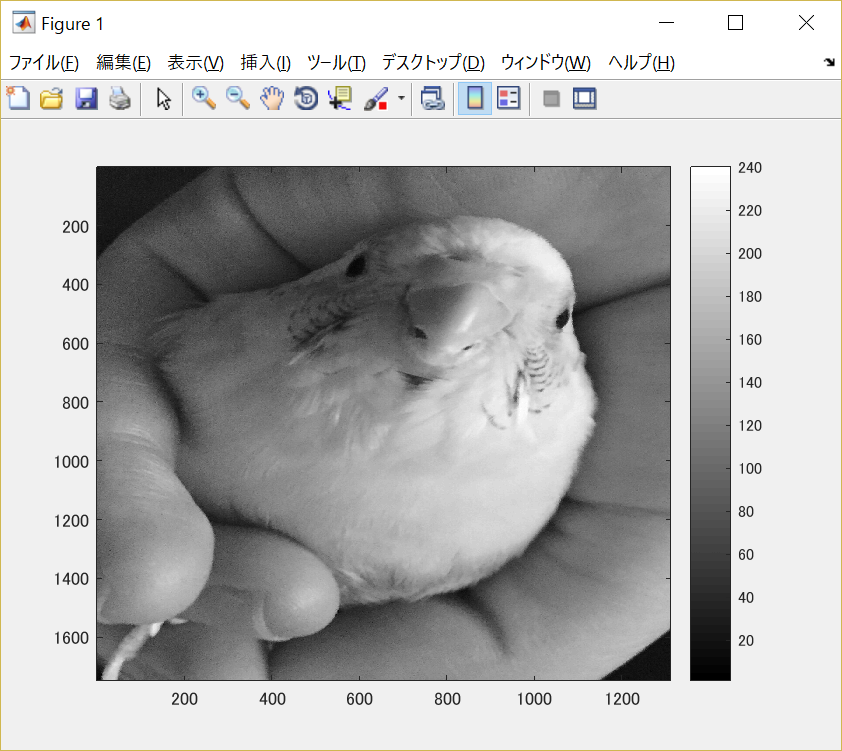
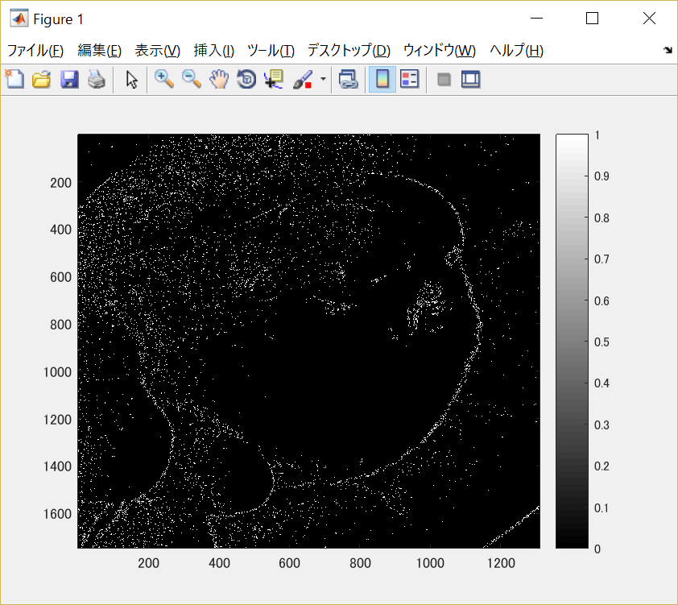
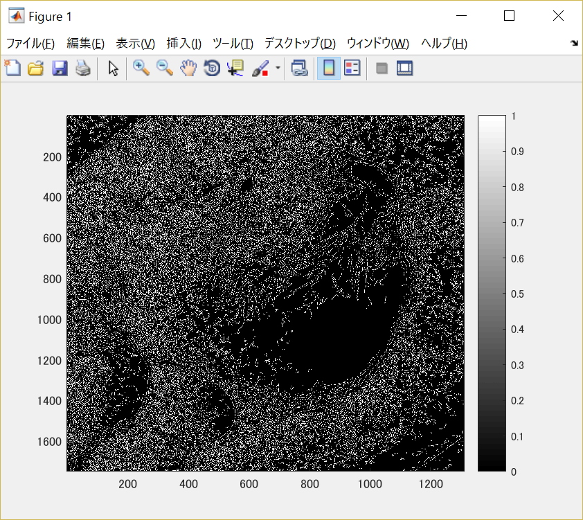

#課題10

画像「Shell.png」を原画像とし、読み込む。

原画像を読み込み、表示した結果が図1の様になる。

図1　原画像

まず原画像をグレースケール画像に変換する。

	ORG = imread('Shell.jpg'); % 原画像の入力
	ORG = rgb2gray(ORG); %カラーからグレイへの変換
	imagesc(ORG); colormap('gray'); colorbar;% 画像表示

その結果を図2に示す。

図2　グレースケール画像

この画像を用いて、画像のエッジ抽出を行う。

エッジ抽出は

	IMG = edge(IMG,'メソッド');

で処理することが出来る。

今回、プレウィット法、ソベル法、キャニー法を実行し、結果も表示した。

1.プレウィット法

	IMG = edge(ORG,'prewitt'); % エッジ抽出（プレウィット法）
	imagesc(IMG); colormap('gray'); colorbar;% 画像表示

図3　プレウィット法適用後の画像

2.ソベル法

	IMG = edge(ORG,'sobel'); % エッジ抽出（ソベル法）
	imagesc(IMG); colormap('gray'); colorbar;% 画像表示

図4　ソベル法適用後の画像

3.キャニー法

	IMG = edge(ORG,'canny'); % エッジ抽出（キャニー法）
	imagesc(IMG); colormap('gray'); colorbar;% 画像表示

図5　キャニー法適用後の画像
