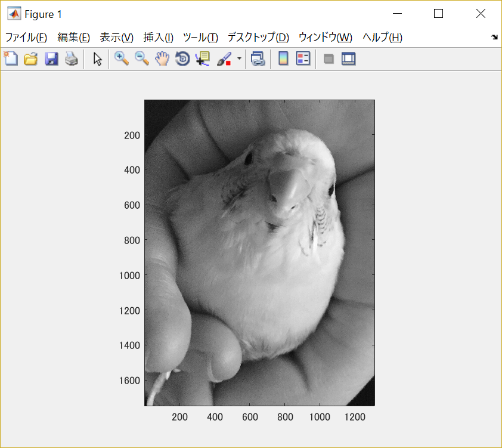
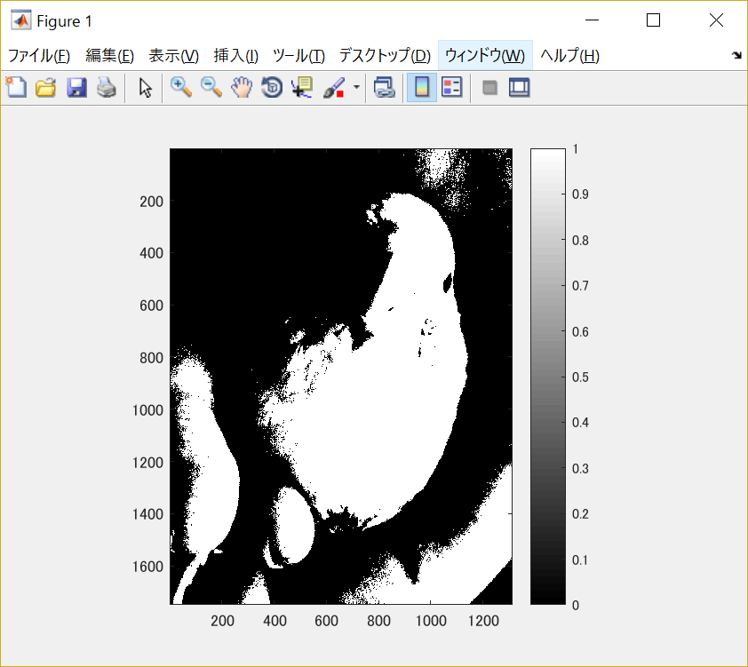
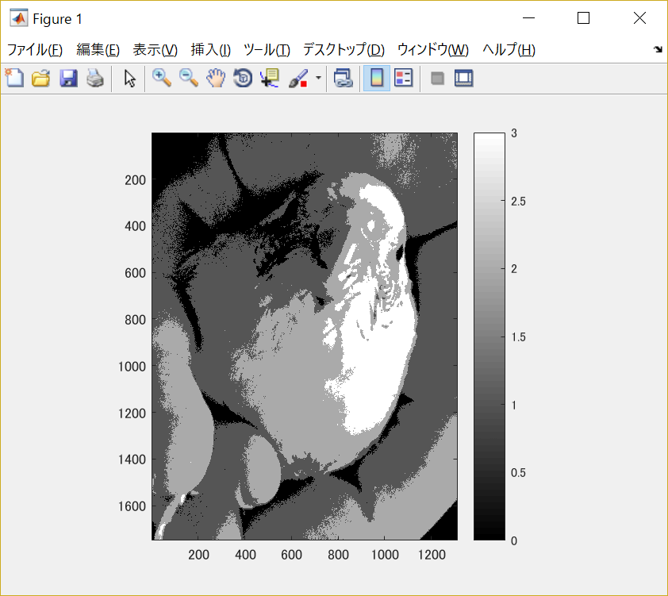
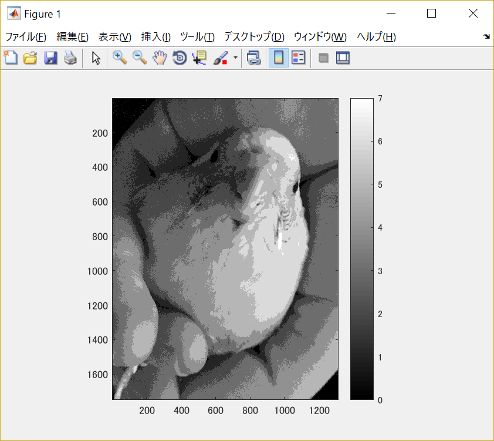

#課題2

画像「shell.png」を原画像とする。

原画像を読み込み、表示した結果が図1の様になる。

図1　原画像

原画像を用い、2階調、4階調、8階調の画像を生成する。

そのために原画像をグレースケール画像に変換する。

	ORG=imread('Shell.jpg'); % 原画像の入力
	ORG = rgb2gray(ORG); colormap(gray); colorbar;
	imagesc(ORG); axis image; % 画像の表示

その結果を表示すると図2の様になる。

図2　グレースケール画像

まず2階調画像を生成する。

2階調画像は濃度値を2分割した画像のことで、256の値を0～127と128～255に分けることが出来る。

	IMG = ORG>128;
	imagesc(IMG); colormap(gray); colorbar;  axis image;

その結果を表示した画像が図3である。

図3　2階調画像

4階調画像と8階調画像も2階調画像と同様に濃度値の設定をしていくことで生成出来る。
4階調画像は濃度値を4分割して表示する。

	IMG0 = ORG>64;
	IMG1 = ORG>128;
	IMG2 = ORG>192;
	IMG = IMG0 + IMG1 + IMG2;
	imagesc(IMG); colormap(gray); colorbar;  axis image;

その結果を表示した画像が図4である。

図4　4階調画像

8階調画像は濃度値を8分割して表示する。

	IMG0 = ORG>32;
	IMG1 = ORG>64;
	IMG2 = ORG>96;
	IMG3 = ORG>128;
	IMG4 = ORG>160;
	IMG5 = ORG>192;
	IMG6 = ORG>224;
	IMG = IMG0 + IMG1 + IMG2 + IMG3 + IMG4 + IMG5 + IMG6;
	imagesc(IMG); colormap(gray); colorbar;  axis image;

その結果を表紙した画像が図5である。

図5　8階調画像

階調数が高くなるとグレースケール画像に近付いていることが分かる。

階調数によって色の表現が変わるため、階調数が低い際の色の濃淡の境界が輪郭の様に見える現象を「疑似輪郭」と言う。