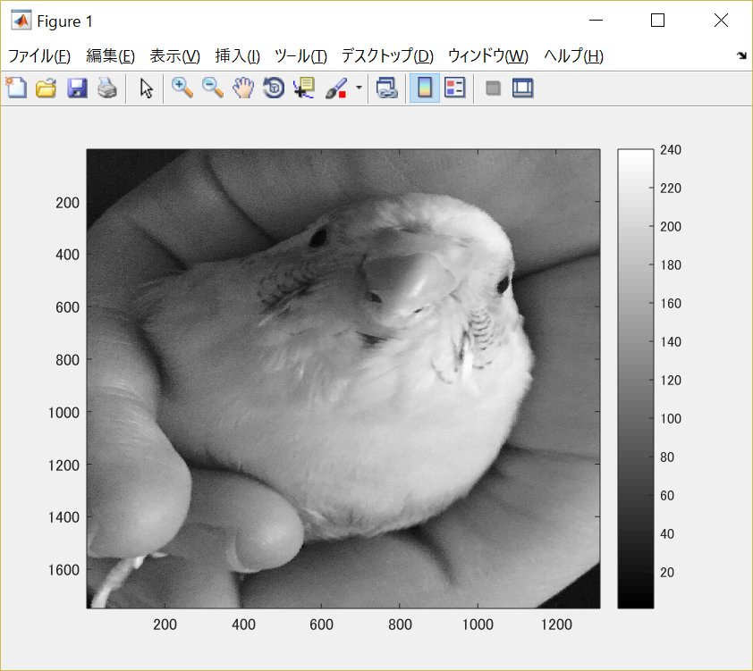
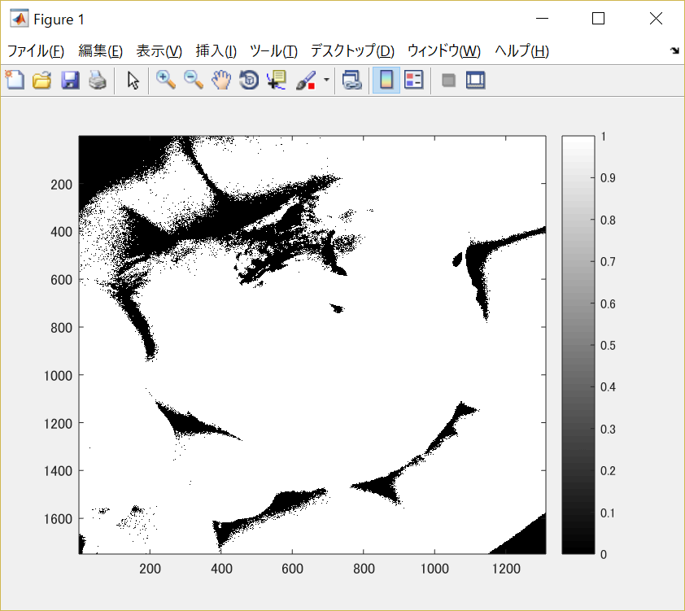
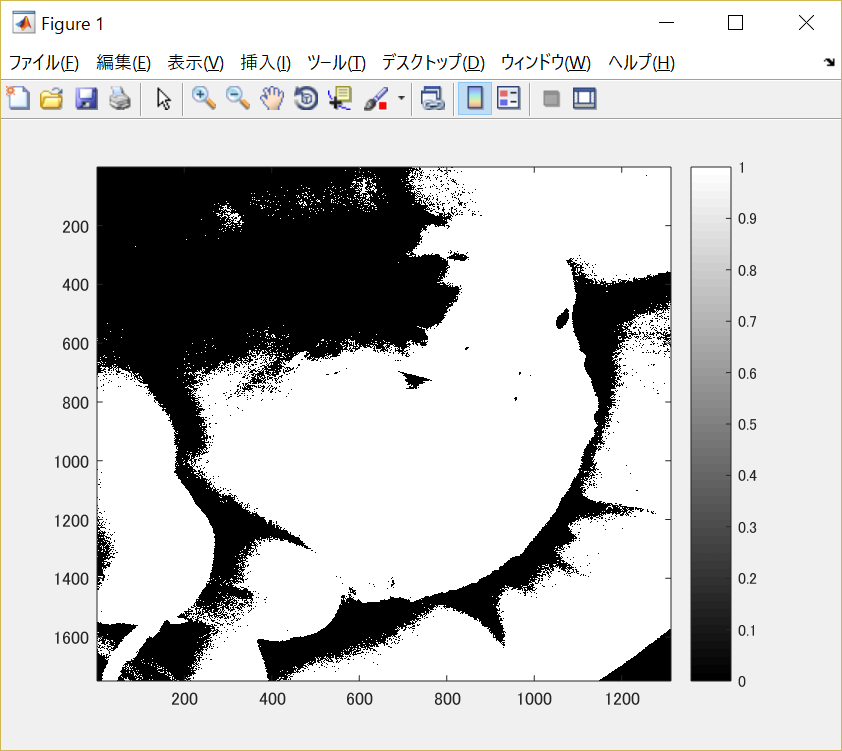
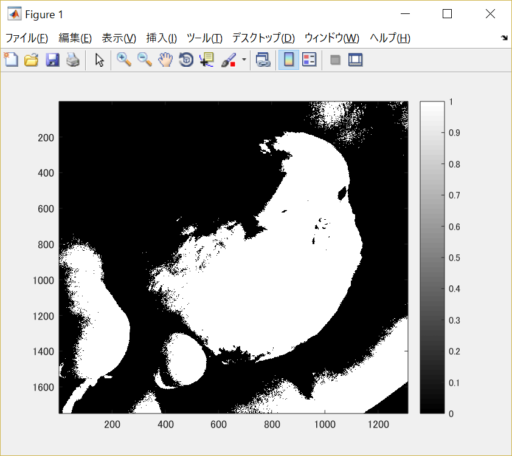
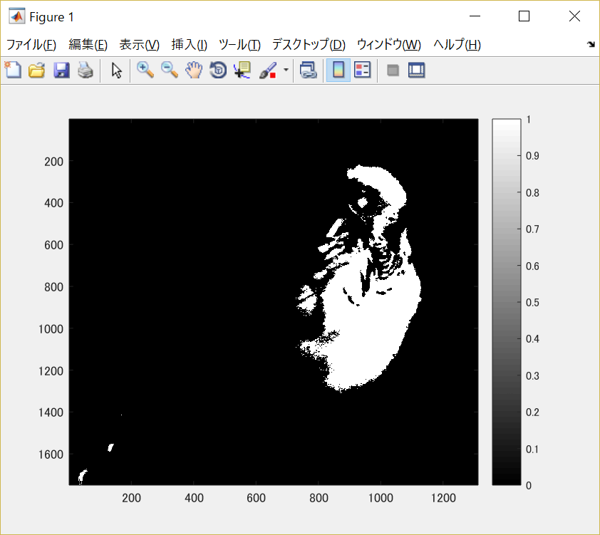

#課題3

画像「Shell.png」を原画像とし、読み込む。

原画像を読み込み、表示した結果が図1の様になる。

図1　原画像

まず原画像をグレースケール画像に変換する。

	ORG=imread('Shell.jpg'); % 原画像の入力
	ORG= rgb2gray(ORG); % カラー画像を白黒濃淡画像へ変換
	imagesc(ORG); colormap(gray); colorbar; % 画像の表示

その結果を図2に示す。

図2　グレースケール画像

このグレースケール画像を用いて4種類の閾値処理した画像を生成する。

2値画像における閾値処理とは、閾値と呼ばれる基準となる値を設定し、閾値と濃度値を比較して黒(0)か白(1)かを決定して変換する。

まず閾値を64として画像を変換する。

	IMG = ORG > 64; % 輝度値が64以上の画素を1，その他を0に変換
	imagesc(IMG); colormap(gray); colorbar;

その結果を図3に示す。

図3　閾値を64に設定し処理した画像

次に閾値を96として画像を変換する。

	IMG = ORG > 96;
	imagesc(IMG); colormap(gray); colorbar;

その結果を図4に示す。

図4　閾値を96に設定し処理した画像

次に閾値を128として画像を変換する。

	IMG = ORG > 128;
	imagesc(IMG); colormap(gray); colorbar;

その結果を図5に示す。

図5　閾値を128に設定し処理した画像

次に閾値を192として画像を変換する。

	IMG = ORG > 192;
	imagesc(IMG); colormap(gray); colorbar;

その結果を図6に示す。

図6　閾値を192に設定し処理した画像

閾値より小さい濃度値は黒(0)、大きい濃度値は白(1)となる様に閾値とは濃度の境界のことであることが分かる。

閾値が大きくなると画像の黒(0)の割合が多くなり白(1)の割合が少なくなる。