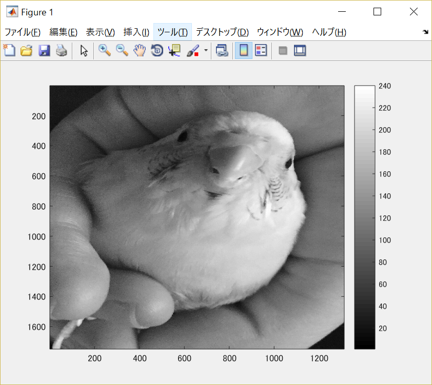
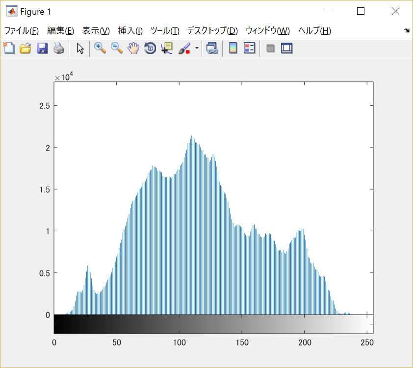

#課題4

画像「Shell.png」を原画像とし、読み込む。

原画像を読み込み、表示した結果が図1の様になる。

図1　原画像

まず原画像をグレースケール画像に変換する。

	ORG=imread('Shell.jpg'); % 原画像の入力
	ORG= rgb2gray(ORG); % カラー画像を白黒濃淡画像へ変換
	imagesc(ORG); colormap(gray); colorbar; % 画像の表示

その結果を図2に示す。

図2　グレースケール画像

このグレースケール画像を用いて、画素の濃度ヒストグラムの生成する。

	imhist(ORG); % ヒストグラムの表示

その結果を図3に示す。

図3　グレースケール画像のヒストグラム

この様に縦軸を出現頻度、横軸を濃度値としたヒストグラムを表示することが出来る。