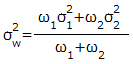
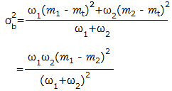
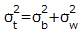
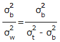
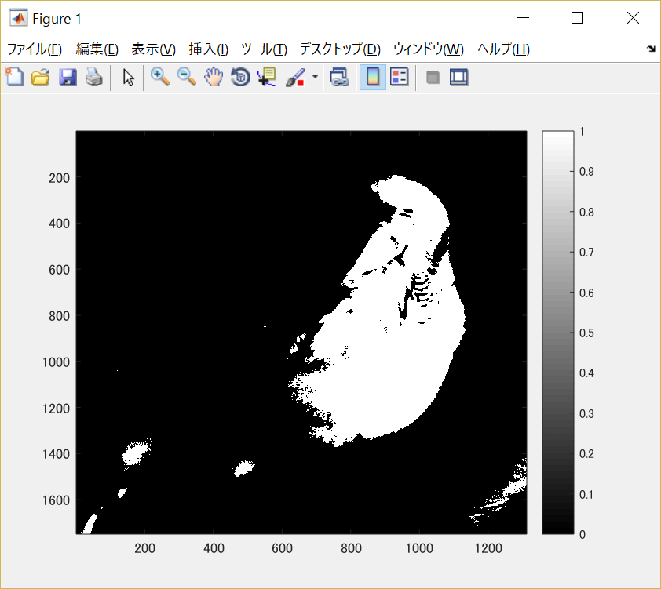

#課題5

画像「Shell.png」を原画像とし、読み込む。

原画像を読み込み、表示した結果が図1の様になる。

図1　原画像

まず原画像をグレースケール画像に変換する。

	ORG=imread('Shell.jpg'); % 原画像の入力
	ORG= rgb2gray(ORG); % カラー画像を白黒濃淡画像へ変換
	imagesc(ORG); colormap(gray); colorbar; % 画像の表示

その結果を図2に示す。

図2　グレースケール画像

この画像を用いて判別分析法で画像を二値化を行う。

判別分析法とは分離度という値が最大となる閾値を求め、自動的に二値化を行う手法である。

分離度はクラス間分散とクラス内分散との比で求めることが出来る。

閾値***t***で二値化したとき、

閾値よりも輝度値が小さい方(黒クラス)の画素数を***ω1***、平均を***m1***、分散を***σ1***、

閾値よりも輝度値が大きい方(白クラス)の画素数を***ω2***、平均を***m2***、分散を***σ2***、

画像全体の画素数を***ωt***、平均を***mt***、分散を***σt***としたとき、

クラス内分散***σw2***は

クラス間分散***σb2***は

と表すことが出来る。

全分散***σt***は

と表すことが出来ることから、求めるクラス間分散とクラス内分散の比である分離度は

となり、この分離度が最大となる閾値***t***を求めれば良い。

	H = imhist(ORG); %ヒストグラムのデータを列ベクトルEに格納
	myu_T = mean(H);
	max_val = 0;
	max_thres = 1;
	for i=1:255
	C1 = H(1:i); %ヒストグラムを2つのクラスに分ける
	C2 = H(i+1:256);
	n1 = sum(C1); %画素数の算出
	n2 = sum(C2);
	myu1 = mean(C1); %平均値の算出
	myu2 = mean(C2);
	sigma1 = var(C1); %分散の算出
	sigma2 = var(C2);
	sigma_w = (n1 *sigma1+n2*sigma2)/(n1+n2); %クラス内分散の算出
	sigma_B = (n1 *(myu1-myu_T)^2+n2*(myu2-myu_T)^2)/(n1+n2); %クラス間分散の算出
	if max_val<sigma_B/sigma_w
	max_val = sigma_B/sigma_w;
	max_thres =i;
	end;
	end;

	IMG = ORG > max_thres;
	imagesc(IMG); colormap(gray); colorbar;
	pause;

この様に判別分析法で二値化した結果の画像を図3に示す。

図3　判別分析法で二値化した画像