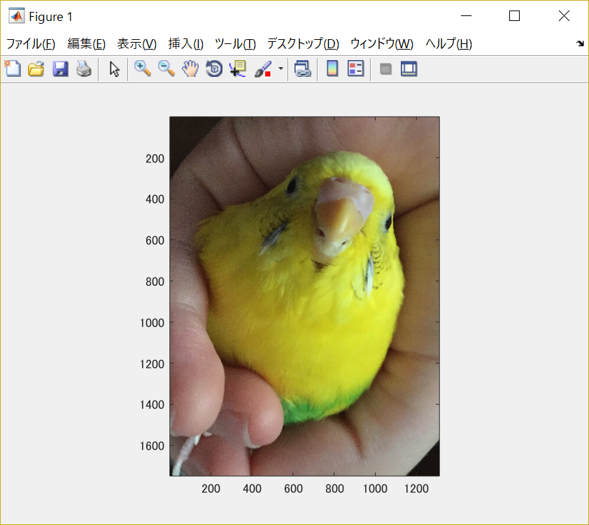
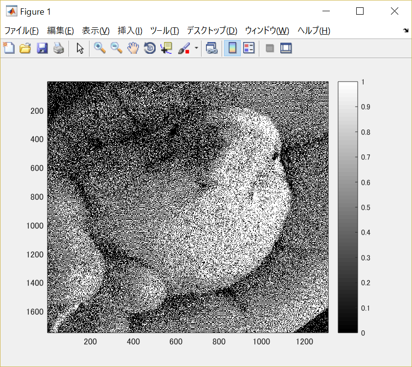

#課題6

画像「Shell.png」を原画像とし、読み込む。

原画像を読み込み、表示した結果が図1の様になる。

図1　原画像

まず原画像をグレースケール画像に変換する。

	ORG=imread('Shell.jpg'); % 原画像の入力
	ORG = rgb2gray(ORG);
	imagesc(ORG); colormap(gray); colorbar; % 画像の表示

その結果を図2に示す。

図2　グレースケール画像

閾値を128に決定し、二値化を行う。

	IMG = ORG>128; % 128による二値化
	imagesc(IMG); colormap(gray); colorbar; % 画像の表示

その結果を図3に示す。

図3　閾値を128に設定し処理した画像

次に、グレースケール画像からディザ法による二値化を行う。

ディザ法とは、ハーフトーン処理の1つで、点の集まりによる密度の差で目の錯覚を利用して表現する方法のことである。

	IMG = dither(ORG); % ディザ法による二値化
	imagesc(IMG); colormap(gray); colorbar; % 画像の表示

その結果を図4に示す。

図4　ディザ法による二値化を行った画像

