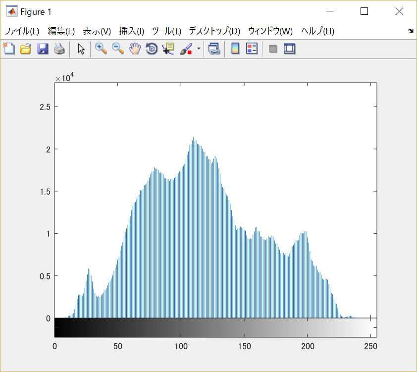
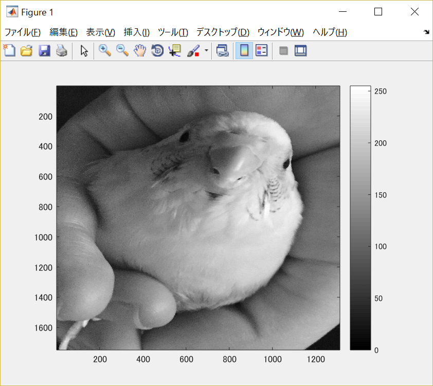
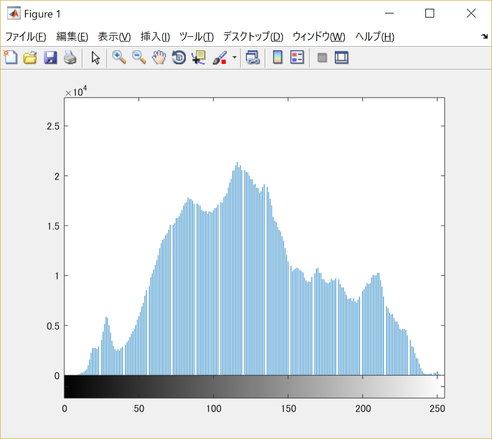

#課題7

画像「Shell.png」を原画像とし、読み込む。

原画像を読み込み、表示した結果が図1の様になる。

図1　原画像

まず原画像をグレースケール画像に変換する。

	ORG=imread('Shell.jpg'); % 原画像の入力
	ORG = rgb2gray(ORG);
	imagesc(ORG); colormap(gray); colorbar; % 画像の表示

その結果を図2に示す。

図2　グレースケール画像

この画像のヒストグラムを表示した結果を図3に示す。

	imhist(ORG); % 濃度ヒストグラムを生成、表示

図3　グレースケール画像のヒストグラム

次に、ダイナミックレンジの拡大を行う。

	ORG = double(ORG);
	mn = min(ORG(:)); % 濃度値の最小値を算出
	mx = max(ORG(:)); % 濃度値の最大値を算出
	ORG = (ORG-mn)/(mx-mn)*255;
	imagesc(ORG); colormap(gray); colorbar; % 画像の表示

その結果を図4に示す。

図4　ダイナミックレンジ拡大画像

最後にこのダイナミック拡大画像のヒストグラムを表示する。

ダイナミック拡大画像はdouble型で表示することが可能であるが、0～255の整数の範囲で表現するには8ビットの符号なし整数への変換は必要になってくるため、unit8型を用いる。

	ORG = uint8(ORG); 
	imhist(ORG); % 濃度ヒストグラムを生成、表示

その結果を図5に示す。

図5　ダイナミックレンジ拡大画像のヒストグラム

図3と図5を比較すると、グレースケール画像のヒストグラムよりもダイナミックレンジ拡大画像のヒストグラムの方が全体的に左に寄っていることが確認できる。