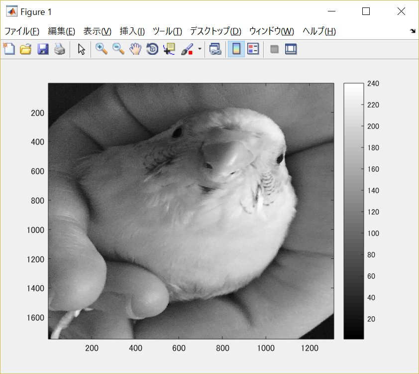
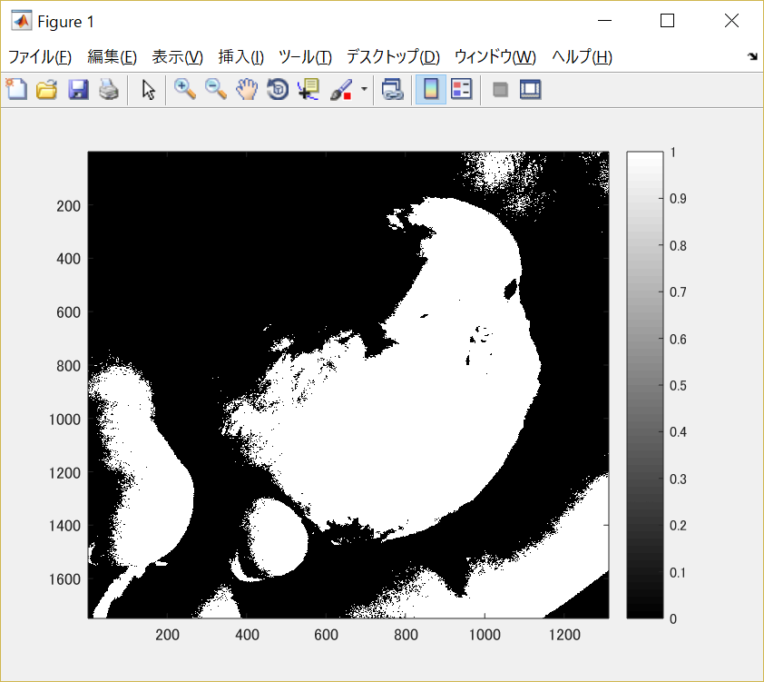
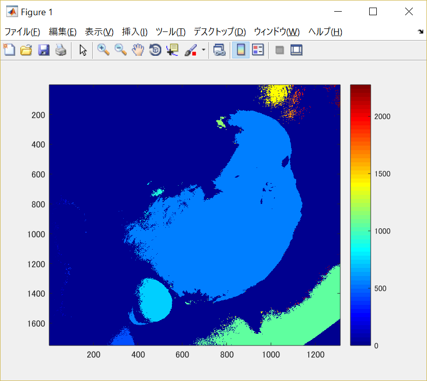

#課題8

画像「Shell.png」を原画像とし、読み込む。

原画像を読み込み、表示した結果が図1の様になる。

図1　原画像

まず原画像をグレースケール画像に変換する。

	ORG=imread('Shell.jpg'); % 原画像の入力
	ORG = rgb2gray(ORG);
	imagesc(ORG); colormap(gray); colorbar; % 画像の表示

その結果を図2に示す。

図2　グレースケール画像

この画像を用いてラベリングを行う。

ラベリングとは同じ画素値を持つ隣接画素に全て同じラベルを設定する処理方法である。

今回は閾値を128に設定して二値化を行う。

	IMG = ORG > 128; % 閾値128で二値化
	imagesc(IMG); colormap(gray); colorbar; % 画像の表示

その結果を図3に示す。

図3　閾値を128に設定し処理した画像

次に、ラベリング処理を行う。

	IMG = bwlabeln(IMG);
	imagesc(IMG); colormap(jet); colorbar; % 画像の表示

その結果を図4に示す。

図4　ラベリング後の画像
