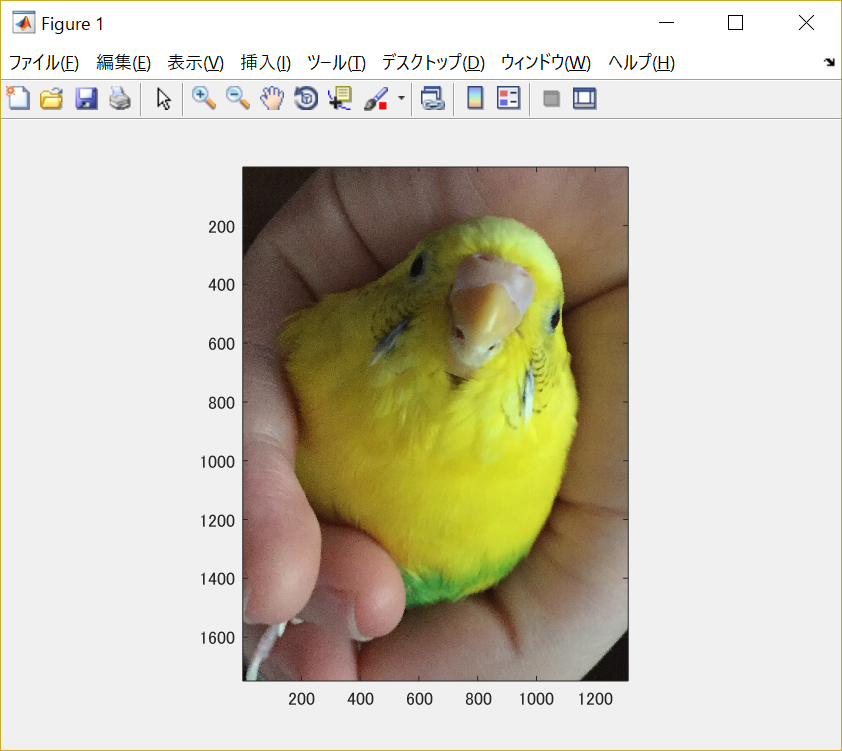

#課題9

画像「Shell.png」を原画像とし、読み込む。

原画像を読み込み、表示した結果が図1の様になる。

図1　原画像

まず原画像をグレースケール画像に変換する。

	ORG=imread('Shell.jpg'); % 原画像の入力
	ORG = rgb2gray(ORG);
	imagesc(ORG); colormap(gray); colorbar; % 画像の表示

その結果を図2に示す。

図2　グレースケール画像

この画像を用いて、メディアンフィルタを適用し、ノイズ除去を行う。

メディアンフィルタを適用するためにノイズ処理を行う。

	ORG = imnoise(ORG,'salt & pepper',0.02); % ノイズ添付
	imagesc(ORG); colormap(gray); colorbar; % 画像の表示

その結果を図3に示す。

図3　ノイズ処理後の画像

次に、平滑フィルタを用いて、ノイズを除去する。

	IMG = filter2(fspecial('average',3),ORG); % 平滑化フィルタで雑音除去
	imagesc(IMG); colormap(gray); colorbar; % 画像の表示

その結果を図4に示す。

図4　平滑フィルタ適用後の画像

そしてこの平滑フィルタ適用後の画像にメディアンフィルタを適用する。

	IMG = medfilt2(ORG,[3 3]); % メディアンフィルタで雑音除去
	imagesc(IMG); colormap(gray); colorbar; % 画像の表示

その結果を図5に示す。

図5　メディアンフィルタ適用後の画像

次に、鮮鋭化を行うためにフィルタを定義する。

	f=[0,-1,0;-1,5,-1;0,-1,0]; % フィルタの設計
	IMG = filter2(f,IMG,'same'); % フィルタの適用
	imagesc(IMG); colormap(gray); colorbar; % 画像の表示

その結果を図6に示す。

図6　鮮鋭化フィルタ適用後の画像

